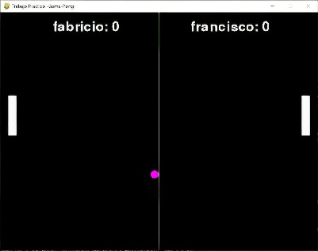

# juego pong en pygame



=======================================================

Este proyecto es una implementacion del juego clasico pong en pygame.
El juego se juega con dos jugadores, uno con la tecla W y S y el otro con la tecla ▲ y ▼ del teclado, para subir y bajar las paletas que serian para que rebote la pelota.
por cada tanto que mete el jugador se muestra en el contador en la parte de arriba, hasta que el jugador llegue a 10 para haber ganado.

Requisitos:

- Archivos JSON:
  - `colores.json`: Contiene los colores para que cambie la pelota.
  - `resultados_pong.json`: Almacena los puntajes de los jugadores.

## Integrantes

    -Insua Fabricio

    -Belen Francisco

### Descripción del código

El código del juego consta de varias funciones y estructuras que gestionan el movimiento de los jugadores, la pelota, el sistema de puntuación y el reinicio del juego. A continuación, se describen las funciones principales y su funcionamiento:

## 1. Configuración inicial ( configuracion_inicial)

 Esta función define los parámetros básicos de la ventana, los colores y las posiciones iniciales de los elementos (pelota, paletas).

    ```python

        def configuracion_inicial():
            # Dimensiones de la ventana
            ANCHO, ALTO = 800, 600

            # Colores
            NEGRO = (0, 0, 0)
            BLANCO = (255, 255, 255)

            # Parámetros de la pelota
            PELOTA = {"x": ANCHO // 2, "y": ALTO // 2, "dx": 4, "dy": 4, "radio": 10}

            # Posición de las paletas
            PALETA_IZQ = {"x": 20, "y": ALTO // 2 - 60, "ancho": 10, "alto": 120}
            PALETA_DER = {"x": ANCHO - 30, "y": ALTO // 2 - 60, "ancho": 10, "alto": 120}

            return ANCHO, ALTO, NEGRO, BLANCO, PELOTA, PALETA_IZQ, PALETA_DER

## 2. Dibujo de elementos ( dibujar_elementos)

Se encarga de renderizar los elementos (pelota, paletas, puntuación) en la pantalla.

    ```python

        def dibujar_elementos(pantalla, colores, pelota, paleta_izq, paleta_der, puntos):
            pantalla.fill(colores["NEGRO"])  # Fondo negro
            pygame.draw.circle(pantalla, colores["BLANCO"], (pelota["x"], pelota["y"]), pelota["radio"])
            pygame.draw.rect(pantalla, colores["BLANCO"], (paleta_izq["x"], paleta_izq["y"], paleta_izq["ancho"], paleta_izq["alto"]))
            pygame.draw.rect(pantalla, colores["BLANCO"], (paleta_der["x"], paleta_der["y"], paleta_der["ancho"], paleta_der["alto"]))

            # Dibujar la puntuación
            fuente = pygame.font.Font(None, 74)
            texto_izq = fuente.render(str(puntos["izq"]), True, colores["BLANCO"])
            texto_der = fuente.render(str(puntos["der"]), True, colores["BLANCO"])
            pantalla.blit(texto_izq, (200, 20))
            pantalla.blit(texto_der, (600, 20))

## 3. Movimiento de la Pelota ( mover_pelota)

Actualiza la posición de la pelota y detecta colisiones con las paredes y las paletas.

    ```python

        def mover_pelota(pelota, paleta_izq, paleta_der, puntos, alto):
        pelota["x"] += pelota["dx"]
        pelota["y"] += pelota["dy"]

        # Rebote en la parte superior e inferior
        if pelota["y"] - pelota["radio"] <= 0 or pelota["y"] + pelota["radio"] >= alto:
            pelota["dy"] *= -1

        # Rebote en las paletas
        if (paleta_izq["x"] < pelota["x"] < paleta_izq["x"] + paleta_izq["ancho"] and
                paleta_izq["y"] < pelota["y"] < paleta_izq["y"] + paleta_izq["alto"]):
            pelota["dx"] *= -1
        if (paleta_der["x"] < pelota["x"] < paleta_der["x"] + paleta_der["ancho"] and
                paleta_der["y"] < pelota["y"] < paleta_der["y"] + paleta_der["alto"]):
            pelota["dx"] *= -1

        # Puntos
        if pelota["x"] < 0:
            puntos["der"] += 1
            return True  # Reiniciar
        elif pelota["x"] > 800:
            puntos["izq"] += 1
            return True

        return False

## 4. Control de Paletas ( mover_paletas)

Controla el movimiento de las paletas con las teclas W/S para la izquierda y ↑/↓ para la derecha.

    ```python
    def mover_paletas(eventos, paleta_izq, paleta_der, alto):
    keys = pygame.key.get_pressed()

    # Movimiento de la paleta izquierda
    if keys[pygame.K_w] and paleta_izq["y"] > 0:
        paleta_izq["y"] -= 5
    if keys[pygame.K_s] and paleta_izq["y"] + paleta_izq["alto"] < alto:
        paleta_izq["y"] += 5

    # Movimiento de la paleta derecha
    if keys[pygame.K_UP] and paleta_der["y"] > 0:
        paleta_der["y"] -= 5
    if keys[pygame.K_DOWN] and paleta_der["y"] + paleta_der["alto"] < alto:
        paleta_der["y"] += 5

## 5. Reinicio del Juego ( reiniciar_juego)

Se ejecuta cuando la pelota sale de la pantalla, reiniciando su posición.

    ```python

        def reiniciar_juego(pelota, ancho, alto):
        pelota["x"], pelota["y"] = ancho // 2, alto // 2
        pelota["dx"] *= -1
        pelota["dy"] *= -1

## 6. Función principal ( main)

La función principal inicializa el juego y contiene el bucle principal.

    ```python

        def main():
        pygame.init()
        ANCHO, ALTO, NEGRO, BLANCO, pelota, paleta_izq, paleta_der = configuracion_inicial()
        pantalla = pygame.display.set_mode((ANCHO, ALTO))
        pygame.display.set_caption("Pong")

        puntos = {"izq": 0, "der": 0}
        colores = {"NEGRO": NEGRO, "BLANCO": BLANCO}

        reloj = pygame.time.Clock()
        ejecutando = True

        while ejecutando:
            for evento in pygame.event.get():
                if evento.type == pygame.QUIT:
                    ejecutando = False

            mover_paletas(pygame.key.get_pressed(), paleta_izq, paleta_der, ALTO)

            if mover_pelota(pelota, paleta_izq, paleta_der, puntos, ALTO):
                reiniciar_juego(pelota, ANCHO, ALTO)

            dibujar_elementos(pantalla, colores, pelota, paleta_izq, paleta_der, puntos)
            pygame.display.flip()
            reloj.tick(60)

        pygame.quit()

### `Archivo colores.json`

    {
    "colores": [
        [255, 0, 0],       
        [0, 255, 0],       
        [0, 0, 255],       
        [255, 255, 0],     
        [255, 165, 0],     
        [128, 0, 128],     
        [0, 255, 255],     
        [255, 20, 147],    
        [139, 69, 19],     
        [75, 0, 130],      
        [0, 128, 0],      
        [128, 128, 128],   
        [255, 192, 203],   
        [128, 0, 0],       
        [0, 0, 128],       
        [255, 105, 180],   
        [173, 216, 230],   
        [255, 215, 0],     
        [112, 128, 144],   
        [240, 128, 128],   
        [255, 99, 71],     
        [255, 69, 0],      
        [34, 139, 34],     
        [60, 179, 113],    
        [255, 160, 122],   
        [255, 99, 71],     
        [32, 178, 170],    
        [128, 128, 0],     
        [255, 0, 255],     
        [0, 255, 0],       
        [0, 0, 0],         
        [255, 239, 182],   
        [245, 245, 220],   
        [240, 230, 140],   
        [0, 0, 0],         
        [255, 0, 255],     
        [255, 105, 180],   
        [204, 51, 255],    
        [240, 248, 255],   
        [245, 222, 179],   
        [255, 228, 181],   
        [218, 165, 32],    
        [255, 222, 173],   
        [255, 240, 245],   
        [253, 245, 230],   
        [189, 183, 107],   
        [102, 205, 170],   
        [186, 85, 211],    
        [255, 192, 203]
    ]
}

### `Archivo resultados_pong.json`

    [
        {
            "ganador": {
                "nombre": "fabricio",
                "puntos": 10
            },
            "perdedor": {
                "nombre": "francisco",
                "puntos": 8
            }
        },
        {
            "ganador": {
                "nombre": "fabricio",
                "puntos": 10
            },
            "perdedor": {
                "nombre": "patricio",
                "puntos": 9
            }
        }
    ]
